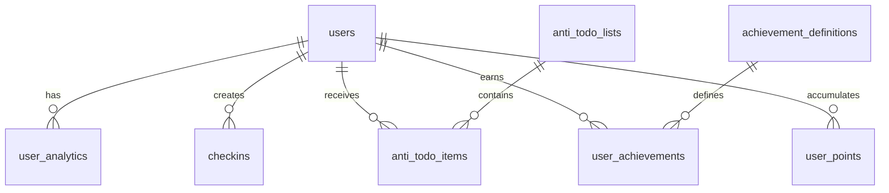

# 🗄️ Offly Database Schema Documentation

> **Comprehensive database schema for the Offly AI-powered mood tracking and wellness platform**

## 📋 Table of Contents

- [Overview](#-overview)
- [Core Tables](#-core-tables)
- [Relationships](#-relationships)
- [Indexes & Performance](#-indexes--performance)
- [Security & RLS](#-security--rls)
- [Views & Functions](#-views--functions)
- [Data Types & Constraints](#-data-types--constraints)
- [Migration Guide](#-migration-guide)

---

## 🌟 Overview

The Offly database is built on **PostgreSQL** via **Supabase** and uses modern database patterns:

- **Row Level Security (RLS)** for data privacy
- **Real-time subscriptions** for live updates  
- **Optimized indexes** for performance
- **Foreign key constraints** for data integrity
- **Automatic timestamps** for audit trails
- **UUID primary keys** for security and scalability

### 📊 Database Statistics
- **Total Tables**: 15+ core tables
- **Total Views**: 5+ optimized views
- **Total Functions**: 10+ stored procedures
- **Data Encryption**: At-rest and in-transit
- **Backup Strategy**: Automated daily backups

---

## 🗂 Core Tables

### 👤 **User Management**

#### `users`
**Primary user profiles and preferences**

| Column | Type | Constraints | Description |
|--------|------|-------------|-------------|
| `id` | `uuid` | `PRIMARY KEY` | User unique identifier (matches Supabase auth) |
| `email` | `text` | `UNIQUE, NOT NULL` | User email address |
| `username` | `text` | `UNIQUE` | Display name/username |
| `hobbies` | `text[]` | `DEFAULT '{}'` | Array of user interests |
| `preferred_activities` | `text[]` | `DEFAULT '{}'` | Preferred activity types |
| `avatar_url` | `text` | `NULL` | Profile picture URL |
| `timezone` | `text` | `DEFAULT 'UTC'` | User timezone |
| `onboarding_completed` | `boolean` | `DEFAULT false` | Onboarding status |
| `created_at` | `timestamptz` | `DEFAULT now()` | Account creation timestamp |
| `updated_at` | `timestamptz` | `DEFAULT now()` | Last update timestamp |

**Indexes:**
- `idx_users_email` on `(email)`
- `idx_users_username` on `(username)` 
- `idx_users_created_at` on `(created_at)`

---

#### `user_analytics`
**Comprehensive user analytics and metrics**

| Column | Type | Constraints | Description |
|--------|------|-------------|-------------|
| `id` | `uuid` | `PRIMARY KEY` | Analytics record ID |
| `user_id` | `uuid` | `FOREIGN KEY -> users(id)` | Associated user |
| `level` | `integer` | `DEFAULT 1` | User gamification level |
| `xp` | `integer` | `DEFAULT 0` | Experience points |
| `next_level_xp` | `integer` | `DEFAULT 100` | XP needed for next level |
| `daily_checkins` | `integer` | `DEFAULT 0` | Total daily check-ins |
| `total_checkins` | `integer` | `DEFAULT 0` | Lifetime check-ins |
| `current_ai_score` | `real` | `DEFAULT 0` | Latest AI mood score |
| `today_average` | `real` | `DEFAULT 0` | Today's average mood |
| `overall_average` | `real` | `DEFAULT 0` | Lifetime mood average |
| `current_streak` | `integer` | `DEFAULT 0` | Current check-in streak |
| `longest_streak` | `integer` | `DEFAULT 0` | Best streak achieved |
| `last_checkin_date` | `date` | `NULL` | Last check-in date |
| `weekly_unique_checkin_days` | `integer` | `DEFAULT 0` | Unique days this week |
| `weekly_score` | `real` | `DEFAULT 0` | This week's mood score |
| `monthly_checkins` | `integer` | `DEFAULT 0` | This month's check-ins |
| `created_at` | `timestamptz` | `DEFAULT now()` | Record creation |
| `updated_at` | `timestamptz` | `DEFAULT now()` | Last update |

**Indexes:**
- `idx_user_analytics_user_id` on `(user_id)`
- `idx_user_analytics_level` on `(level)`
- `idx_user_analytics_streak` on `(current_streak)`

---

### 📝 **Mood Tracking**

#### `checkins`
**Daily mood check-ins with AI analysis**

| Column | Type | Constraints | Description |
|--------|------|-------------|-------------|
| `id` | `uuid` | `PRIMARY KEY` | Check-in unique ID |
| `user_id` | `uuid` | `FOREIGN KEY -> users(id)` | User who checked in |
| `mood_score` | `integer` | `CHECK (mood_score >= 1 AND mood_score <= 10)` | Mood rating 1-10 |
| `notes` | `text` | `NULL` | Optional mood notes |
| `ai_sentiment_score` | `real` | `NULL` | AI-analyzed sentiment (-1 to 1) |
| `ai_confidence` | `real` | `NULL` | AI confidence level (0 to 1) |
| `ai_insights` | `jsonb` | `NULL` | AI-generated insights |
| `activities` | `text[]` | `DEFAULT '{}'` | Activities done that day |
| `energy_level` | `integer` | `CHECK (energy_level >= 1 AND energy_level <= 5)` | Energy rating 1-5 |
| `sleep_hours` | `real` | `NULL` | Hours of sleep |
| `weather` | `text` | `NULL` | Weather description |
| `location` | `text` | `NULL` | General location |
| `created_at` | `timestamptz` | `DEFAULT now()` | Check-in timestamp |
| `checkin_date` | `date` | `DEFAULT CURRENT_DATE` | Check-in date (for uniqueness) |

**Constraints:**
- `UNIQUE(user_id, checkin_date)` - One check-in per user per day

**Indexes:**
- `idx_checkins_user_id` on `(user_id)`
- `idx_checkins_date` on `(checkin_date)`
- `idx_checkins_mood_score` on `(mood_score)`
- `idx_checkins_created_at` on `(created_at)`

---

### 🎯 **Activities & Wellness**

#### `anti_todo_items`
**AI-generated wellness activities**

| Column | Type | Constraints | Description |
|--------|------|-------------|-------------|
| `id` | `uuid` | `PRIMARY KEY` | Activity unique ID |
| `user_id` | `uuid` | `FOREIGN KEY -> users(id)` | Target user |
| `title` | `text` | `NOT NULL` | Activity title |
| `description` | `text` | `NULL` | Detailed description |
| `category` | `text` | `NOT NULL` | Activity category |
| `difficulty` | `text` | `DEFAULT 'medium'` | Difficulty level |
| `estimated_duration` | `integer` | `NULL` | Duration in minutes |
| `hobbies_matched` | `text[]` | `DEFAULT '{}'` | Matching user hobbies |
| `mood_context` | `text` | `NULL` | Mood when generated |
| `ai_generated` | `boolean` | `DEFAULT true` | Generated by AI |
| `completion_points` | `integer` | `DEFAULT 10` | Points for completion |
| `completed` | `boolean` | `DEFAULT false` | Completion status |
| `completed_at` | `timestamptz` | `NULL` | Completion timestamp |
| `created_at` | `timestamptz` | `DEFAULT now()` | Creation timestamp |

**Indexes:**
- `idx_anti_todo_items_user_id` on `(user_id)`
- `idx_anti_todo_items_category` on `(category)`
- `idx_anti_todo_items_completed` on `(completed)`
- `idx_anti_todo_items_difficulty` on `(difficulty)`

---

#### `anti_todo_lists`
**Organized collections of anti-todo items**

| Column | Type | Constraints | Description |
|--------|------|-------------|-------------|
| `id` | `uuid` | `PRIMARY KEY` | List unique ID |
| `user_id` | `uuid` | `FOREIGN KEY -> users(id)` | List owner |
| `name` | `text` | `NOT NULL` | List name |
| `description` | `text` | `NULL` | List description |
| `theme` | `text` | `NULL` | Visual theme |
| `is_active` | `boolean` | `DEFAULT true` | Active status |
| `item_count` | `integer` | `DEFAULT 0` | Number of items |
| `completion_rate` | `real` | `DEFAULT 0` | Completion percentage |
| `created_at` | `timestamptz` | `DEFAULT now()` | Creation timestamp |
| `updated_at` | `timestamptz` | `DEFAULT now()` | Last update |

**Indexes:**
- `idx_anti_todo_lists_user_id` on `(user_id)`
- `idx_anti_todo_lists_active` on `(is_active)`

---

#### `activities`
**User-created activities and tasks**

| Column | Type | Constraints | Description |
|--------|------|-------------|-------------|
| `id` | `uuid` | `PRIMARY KEY` | Activity unique ID |
| `user_id` | `uuid` | `FOREIGN KEY -> users(id)` | Activity owner |
| `title` | `text` | `NOT NULL` | Activity title |
| `description` | `text` | `NULL` | Activity description |
| `status` | `text` | `CHECK (status IN ('pending', 'completed', 'cancelled'))` | Activity status |
| `priority` | `integer` | `CHECK (priority >= 1 AND priority <= 3)` | Priority level |
| `due_date` | `date` | `NULL` | Due date |
| `completed_at` | `timestamptz` | `NULL` | Completion timestamp |
| `created_at` | `timestamptz` | `DEFAULT now()` | Creation timestamp |
| `updated_at` | `timestamptz` | `DEFAULT now()` | Last update |

**Indexes:**
- `idx_activities_user_id` on `(user_id)`
- `idx_activities_status` on `(status)`
- `idx_activities_due_date` on `(due_date)`
- `idx_activities_priority` on `(priority)`

---

### 🏆 **Gamification System**

#### `achievement_definitions`
**Available achievements in the system**

| Column | Type | Constraints | Description |
|--------|------|-------------|-------------|
| `id` | `text` | `PRIMARY KEY` | Achievement unique identifier |
| `name` | `text` | `NOT NULL` | Achievement name |
| `description` | `text` | `NULL` | Achievement description |
| `points_reward` | `integer` | `DEFAULT 10` | Points awarded |
| `category` | `text` | `DEFAULT 'milestone'` | Achievement category |
| `target` | `integer` | `DEFAULT 1` | Target value to achieve |
| `icon` | `text` | `NULL` | Icon identifier |
| `rarity` | `text` | `DEFAULT 'common'` | Achievement rarity |
| `is_active` | `boolean` | `DEFAULT true` | Active status |
| `created_at` | `timestamptz` | `DEFAULT now()` | Creation timestamp |

**Categories:**
- `milestone` - Major progress milestones
- `streak` - Consecutive day achievements  
- `mood` - Mood-related achievements
- `activity` - Activity completion achievements
- `social` - Community achievements
- `special` - Limited-time achievements

**Indexes:**
- `idx_achievement_definitions_category` on `(category)`
- `idx_achievement_definitions_active` on `(is_active)`

---

#### `user_achievements`
**User achievement progress and completions**

| Column | Type | Constraints | Description |
|--------|------|-------------|-------------|
| `id` | `uuid` | `PRIMARY KEY` | Record unique ID |
| `user_id` | `uuid` | `FOREIGN KEY -> users(id)` | User who earned achievement |
| `achievement_id` | `text` | `FOREIGN KEY -> achievement_definitions(id)` | Achievement earned |
| `progress` | `integer` | `DEFAULT 0` | Current progress |
| `completed` | `boolean` | `DEFAULT false` | Completion status |
| `completed_at` | `timestamptz` | `NULL` | Completion timestamp |
| `points_awarded` | `integer` | `DEFAULT 0` | Points received |
| `created_at` | `timestamptz` | `DEFAULT now()` | Record creation |

**Constraints:**
- `UNIQUE(user_id, achievement_id)` - One achievement per user

**Indexes:**
- `idx_user_achievements_user_id` on `(user_id)`
- `idx_user_achievements_completed` on `(completed)`
- `idx_user_achievements_completed_at` on `(completed_at)`

---

#### `user_points`
**User point balances and transactions**

| Column | Type | Constraints | Description |
|--------|------|-------------|-------------|
| `id` | `uuid` | `PRIMARY KEY` | Record unique ID |
| `user_id` | `uuid` | `FOREIGN KEY -> users(id)` | Point owner |
| `total_points` | `integer` | `DEFAULT 0` | Total lifetime points |
| `available_points` | `integer` | `DEFAULT 0` | Spendable points |
| `points_spent` | `integer` | `DEFAULT 0` | Total points spent |
| `last_transaction_at` | `timestamptz` | `NULL` | Last point transaction |
| `created_at` | `timestamptz` | `DEFAULT now()` | Record creation |
| `updated_at` | `timestamptz` | `DEFAULT now()` | Last update |

**Indexes:**
- `idx_user_points_user_id` on `(user_id)`
- `idx_user_points_total` on `(total_points)`

---

### 📊 **Analytics & Tracking**

#### `landing_page_views`
**Landing page analytics and visitor tracking**

| Column | Type | Constraints | Description |
|--------|------|-------------|-------------|
| `id` | `uuid` | `PRIMARY KEY` | View unique ID |
| `page_path` | `text` | `NOT NULL` | Page visited |
| `user_agent` | `text` | `NULL` | Browser user agent |
| `referrer` | `text` | `NULL` | Referrer URL |
| `ip_address` | `inet` | `NULL` | Visitor IP (anonymized) |
| `country` | `text` | `NULL` | Visitor country |
| `session_id` | `text` | `NULL` | Session identifier |
| `created_at` | `timestamptz` | `DEFAULT now()` | View timestamp |

**Indexes:**
- `idx_landing_page_views_path` on `(page_path)`
- `idx_landing_page_views_created_at` on `(created_at)`

---

## 🔗 Relationships

### **Primary Relationships**



### **Key Foreign Keys**

- **`user_analytics.user_id`** → `users.id`
- **`checkins.user_id`** → `users.id`
- **`anti_todo_items.user_id`** → `users.id`
- **`user_achievements.user_id`** → `users.id`
- **`user_achievements.achievement_id`** → `achievement_definitions.id`
- **`user_points.user_id`** → `users.id`

---

## ⚡ Indexes & Performance

### **Primary Indexes**
```sql
-- User lookups
CREATE INDEX idx_users_email ON users(email);
CREATE INDEX idx_users_username ON users(username);

-- Mood tracking performance
CREATE INDEX idx_checkins_user_date ON checkins(user_id, checkin_date);
CREATE INDEX idx_checkins_mood_score ON checkins(mood_score);

-- Activity queries
CREATE INDEX idx_anti_todo_items_user_category ON anti_todo_items(user_id, category);
CREATE INDEX idx_activities_user_status ON activities(user_id, status);

-- Achievement performance
CREATE INDEX idx_user_achievements_user_completed ON user_achievements(user_id, completed);
```

### **Composite Indexes**
```sql
-- Analytics dashboard queries
CREATE INDEX idx_user_analytics_comprehensive ON user_analytics(user_id, level, current_streak);

-- Recent activity queries  
CREATE INDEX idx_checkins_recent ON checkins(user_id, created_at DESC);
```

---

## 🛡 Security & RLS

### **Row Level Security (RLS)**

**RLS is enabled** on all user-facing tables with policies:

```sql
-- Users can only see their own data
CREATE POLICY "Users can view own data" ON users
    FOR SELECT USING (auth.uid() = id);

-- Users can only modify their own records
CREATE POLICY "Users can update own data" ON users  
    FOR UPDATE USING (auth.uid() = id);

-- Check-ins are private to users
CREATE POLICY "Users can view own checkins" ON checkins
    FOR ALL USING (auth.uid() = user_id);

-- Achievements are visible to users
CREATE POLICY "Users can view own achievements" ON user_achievements
    FOR SELECT USING (auth.uid() = user_id);
```

### **Security Features**

- ✅ **Row-level data isolation** 
- ✅ **JWT-based authentication**
- ✅ **Encrypted data at rest**
- ✅ **API rate limiting**
- ✅ **Input validation**
- ✅ **SQL injection prevention**

---

## 👁 Views & Functions

### **Optimized Views**

#### `user_achievements_with_details`
**Combines user achievements with definition details**

```sql
CREATE VIEW user_achievements_with_details AS
SELECT 
    ua.*,
    ad.name,
    ad.description,
    ad.icon,
    ad.category,
    ad.rarity
FROM user_achievements ua
JOIN achievement_definitions ad ON ua.achievement_id = ad.id;
```

### **Stored Functions**

#### `calculate_mood_streak(user_id UUID)`
**Calculates current mood check-in streak**

#### `award_achievement(user_id UUID, achievement_id TEXT)`
**Awards achievement and points to user**

#### `get_weekly_mood_summary(user_id UUID)`
**Returns comprehensive weekly mood analytics**

---

## 📝 Data Types & Constraints

### **Custom Types**

```sql
-- Mood difficulty levels
CREATE TYPE difficulty_level AS ENUM ('easy', 'medium', 'hard', 'expert');

-- Achievement categories
CREATE TYPE achievement_category AS ENUM ('milestone', 'streak', 'mood', 'activity', 'social', 'special');

-- Activity status
CREATE TYPE activity_status AS ENUM ('pending', 'completed', 'cancelled');
```

### **Validation Constraints**

```sql
-- Mood scores must be 1-10
CHECK (mood_score >= 1 AND mood_score <= 10)

-- Energy levels must be 1-5  
CHECK (energy_level >= 1 AND energy_level <= 5)

-- Priority levels must be 1-3
CHECK (priority >= 1 AND priority <= 3)

-- Points must be non-negative
CHECK (total_points >= 0)
```

---

## 🚀 Migration Guide

### **Initial Setup**

```sql
-- Enable required extensions
CREATE EXTENSION IF NOT EXISTS "uuid-ossp";
CREATE EXTENSION IF NOT EXISTS "pgcrypto";

-- Enable Row Level Security
ALTER TABLE users ENABLE ROW LEVEL SECURITY;
ALTER TABLE user_analytics ENABLE ROW LEVEL SECURITY;
ALTER TABLE checkins ENABLE ROW LEVEL SECURITY;
```

### **Sample Data**

```sql
-- Insert sample achievements
INSERT INTO achievement_definitions (id, name, description, category, target, points_reward) VALUES
('first_checkin', 'First Steps', 'Complete your first mood check-in', 'milestone', 1, 50),
('streak_7', 'Weekly Warrior', 'Maintain a 7-day check-in streak', 'streak', 7, 100),
('mood_perfectionist', 'Perfect Day', 'Record a mood score of 10', 'mood', 1, 25);
```

### **Performance Optimization**

```sql
-- Analyze table statistics
ANALYZE users;
ANALYZE user_analytics; 
ANALYZE checkins;

-- Vacuum for performance
VACUUM ANALYZE;
```

---

## 📊 Database Monitoring

### **Key Metrics to Monitor**

- **Table sizes** and growth rates
- **Query performance** and slow queries
- **Index usage** and effectiveness  
- **Connection counts** and limits
- **RLS policy** performance impact

### **Maintenance Tasks**

- **Daily**: Monitor query performance
- **Weekly**: Review table sizes and indexes
- **Monthly**: Analyze and vacuum tables
- **Quarterly**: Review and optimize RLS policies

---

*📋 This documentation is automatically updated with schema changes*

**Last Updated**: January 2025  
**Schema Version**: v2.1.0  
**Database**: PostgreSQL 15+ via Supabase

**Triggers:**
- `update_activities_updated_at`: Updates `updated_at` on row modification.

---

### `anti_todo_items`

Represents items in a user's "anti-todo" list, which are tasks to avoid.

| Column         | Type                        | Constraints                               | Description                                 |
| -------------- | --------------------------- | ----------------------------------------- | ------------------------------------------- |
| `id`           | `uuid`                      | `NOT NULL`, `PRIMARY KEY`, `DEFAULT uuid_generate_v4()` | Unique identifier for the item.             |
| `list_id`      | `uuid`                      | `FOREIGN KEY` -> `anti_todo_lists(id)`    | The list this item belongs to.              |
| `user_id`      | `uuid`                      | `FOREIGN KEY` -> `users(id)`              | The user who owns this item.                |
| `content`      | `text`                      | `NOT NULL`                                | The content of the anti-todo item.          |
| `is_completed` | `boolean`                   | `DEFAULT false`                           | Whether the user succeeded in avoiding the task. |
| `completed_at` | `timestamp with time zone`  | `NULL`                                    | Timestamp of completion.                    |
| `created_at`   | `timestamp with time zone`  | `DEFAULT now()`                           | Timestamp of creation.                      |
| `updated_at`   | `timestamp with time zone`  | `DEFAULT now()`                           | Timestamp of the last update.               |
| `status`       | `text`                      | `DEFAULT 'not started'::text`, `CHECK`    | Status: `not started`, `ongoing`, `completed`, `stopped`. |
| `source`       | `text`                      | `DEFAULT 'user'::text`                    | Source of the item (e.g., 'user', 'ai').    |

**Indexes:**
- `idx_anti_todo_items_list_id` on `(list_id)`
- `idx_anti_todo_items_user_id` on `(user_id)`
- `idx_anti_todo_items_completed` on `(is_completed)`
- `idx_anti_todo_items_user_status` on `(user_id, status, created_at DESC)`
- `idx_anti_todo_items_source_status` on `(user_id, source, status)`
- `idx_anti_todo_items_status` on `(status)`

**Triggers:**
- `update_anti_todo_items_updated_at`: Updates `updated_at` on row modification.

---

### `anti_todo_lists`

Represents a collection of "anti-todo" items for a user.

| Column        | Type                        | Constraints                               | Description                                 |
| ------------- | --------------------------- | ----------------------------------------- | ------------------------------------------- |
| `id`          | `uuid`                      | `NOT NULL`, `PRIMARY KEY`, `DEFAULT uuid_generate_v4()` | Unique identifier for the list.             |
| `user_id`     | `uuid`                      | `FOREIGN KEY` -> `users(id)`              | The user who owns this list.                |
| `title`       | `text`                      | `NOT NULL`                                | The title of the list.                      |
| `description` | `text`                      | `NULL`                                    | A description of the list.                  |
| `category`    | `text`                      | `NULL`                                    | Category for the list.                      |
| `is_archived` | `boolean`                   | `DEFAULT false`                           | Whether the list is archived.               |
| `created_at`  | `timestamp with time zone`  | `DEFAULT now()`                           | Timestamp of creation.                      |
| `updated_at`  | `timestamp with time zone`  | `DEFAULT now()`                           | Timestamp of the last update.               |

**Indexes:**
- `idx_anti_todo_lists_user_id` on `(user_id)`
- `idx_anti_todo_lists_archived` on `(is_archived)`

**Triggers:**
- `update_anti_todo_lists_updated_at`: Updates `updated_at` on row modification.

---

### `checkins`

Stores daily user check-ins, including mood and other metrics.

| Column            | Type                        | Constraints                               | Description                                 |
| ----------------- | --------------------------- | ----------------------------------------- | ------------------------------------------- |
| `id`              | `uuid`                      | `NOT NULL`, `PRIMARY KEY`, `DEFAULT uuid_generate_v4()` | Unique identifier for the check-in.         |
| `user_id`         | `uuid`                      | `FOREIGN KEY` -> `users(id)`              | The user performing the check-in.           |
| `mood_score`      | `integer`                   | `NOT NULL`, `CHECK`                       | Mood score from 1 to 10.                    |
| `mood_text`       | `text`                      | `NULL`                                    | User's description of their mood.           |
| `mood_emoji`      | `text`                      | `DEFAULT ''::text`                        | Emoji representing the mood.                |
| `hashtags`        | `text`                      | `NULL`                                    | Hashtags associated with the check-in.      |
| `ai_score`        | `real`                      | `DEFAULT 0`                               | AI-calculated score for the check-in.       |
| `sentiment_score` | `real`                      | `DEFAULT 0`                               | Sentiment analysis score.                   |
| `checkin_date`    | `date`                      | `DEFAULT CURRENT_DATE`                    | The date of the check-in.                   |
| `checkin_time`    | `time without time zone`    | `DEFAULT CURRENT_TIME`                    | The time of the check-in.                   |
| `created_at`      | `timestamp with time zone`  | `DEFAULT now()`                           | Timestamp of creation.                      |
| `updated_at`      | `timestamp with time zone`  | `DEFAULT now()`                           | Timestamp of the last update.               |

**Indexes:**
- `idx_checkins_user_id` on `(user_id)`
- `idx_checkins_date` on `(checkin_date)`
- `idx_checkins_user_date` on `(user_id, checkin_date)`
- `idx_checkins_created_at` on `(created_at)`
- `idx_checkins_mood_score` on `(mood_score)`

**Triggers:**
- `ensure_user_before_checkin`: Ensures a user exists before inserting a check-in.
- `trigger_update_analytics_after_checkin`: Updates user analytics after a check-in.
- `update_checkins_updated_at`: Updates `updated_at` on row modification.

---

### `community_likes`

Tracks likes on community posts.

| Column       | Type                        | Constraints                               | Description                                 |
| ------------ | --------------------------- | ----------------------------------------- | ------------------------------------------- |
| `id`         | `uuid`                      | `NOT NULL`, `PRIMARY KEY`, `DEFAULT uuid_generate_v4()` | Unique identifier for the like.             |
| `user_id`    | `uuid`                      | `NOT NULL`, `FOREIGN KEY` -> `users(id)`  | The user who liked the post.                |
| `post_id`    | `uuid`                      | `NOT NULL`, `FOREIGN KEY` -> `community_posts(id)` | The post that was liked.                    |
| `created_at` | `timestamp with time zone`  | `DEFAULT now()`                           | Timestamp of when the like occurred.        |

**Constraints:**
- `community_likes_user_post_unique` on `(user_id, post_id)`

**Indexes:**
- `idx_community_likes_user_id` on `(user_id)`
- `idx_community_likes_post_id` on `(post_id)`
- `idx_community_likes_created_at` on `(created_at)`

---

### `community_posts`

Stores posts made by users in the community feed.

| Column         | Type                        | Constraints                               | Description                                 |
| -------------- | --------------------------- | ----------------------------------------- | ------------------------------------------- |
| `id`           | `uuid`                      | `NOT NULL`, `PRIMARY KEY`, `DEFAULT uuid_generate_v4()` | Unique identifier for the post.             |
| `user_id`      | `uuid`                      | `NOT NULL`, `FOREIGN KEY` -> `users(id)`  | The user who created the post.              |
| `content_type` | `text`                      | `NOT NULL`, `DEFAULT 'text'::text`, `CHECK` | Type: `text`, `image`, `anti_todo`, `checkin`. |
| `title`        | `text`                      | `NULL`                                    | Title of the post.                          |
| `content`      | `text`                      | `NOT NULL`                                | The main content of the post.               |
| `media_url`    | `text`                      | `NULL`                                    | URL for associated media (e.g., images).    |
| `source_type`  | `text`                      | `NULL`, `CHECK`                           | Source: `anti_todo`, `checkin`, `manual`.   |
| `source_id`    | `uuid`                      | `NULL`                                    | ID of the source item (e.g., a check-in ID). |
| `hashtags`     | `text[]`                    | `NULL`                                    | Array of hashtags for the post.             |
| `is_public`    | `boolean`                   | `DEFAULT true`                            | Whether the post is public.                 |
| `created_at`   | `timestamp with time zone`  | `DEFAULT now()`                           | Timestamp of creation.                      |
| `updated_at`   | `timestamp with time zone`  | `DEFAULT now()`                           | Timestamp of the last update.               |

**Indexes:**
- `idx_community_posts_user_id` on `(user_id)`
- `idx_community_posts_created_at` on `(created_at DESC)`
- `idx_community_posts_public` on `(is_public)`
- `idx_community_posts_source` on `(source_type, source_id)`
- `idx_community_posts_hashtags` on `(hashtags)` (GIN)
- `idx_community_posts_user_public_created` on `(user_id, is_public, created_at DESC)`
- `idx_community_posts_created_at_desc` on `(created_at DESC)`

**Triggers:**
- `update_community_posts_updated_at`: Updates `updated_at` on row modification.

---

### `landing_page_views`

Tracks views of the landing page for analytics.

| Column       | Type                        | Constraints                               | Description                                 |
| ------------ | --------------------------- | ----------------------------------------- | ------------------------------------------- |
| `id`         | `uuid`                      | `NOT NULL`, `PRIMARY KEY`, `DEFAULT uuid_generate_v4()` | Unique identifier for the view.             |
| `page_path`  | `text`                      | `NULL`                                    | The path of the page viewed.                |
| `user_agent` | `text`                      | `NULL`                                    | The user agent of the visitor.              |
| `referrer`   | `text`                      | `NULL`                                    | The referrer URL.                           |
| `ip_address` | `inet`                      | `NULL`                                    | The IP address of the visitor.              |
| `country`    | `text`                      | `NULL`                                    | The country of the visitor.                 |
| `created_at` | `timestamp with time zone`  | `DEFAULT now()`                           | Timestamp of the view.                      |

**Indexes:**
- `idx_landing_page_views_created_at` on `(created_at)`

---

### `notifications`

Stores notifications for users.

| Column      | Type                        | Constraints                               | Description                                 |
| ----------- | --------------------------- | ----------------------------------------- | ------------------------------------------- |
| `id`        | `uuid`                      | `NOT NULL`, `PRIMARY KEY`, `DEFAULT uuid_generate_v4()` | Unique identifier for the notification.     |
| `user_id`   | `uuid`                      | `FOREIGN KEY` -> `users(id)`              | The user receiving the notification.        |
| `title`     | `text`                      | `NOT NULL`                                | The title of the notification.              |
| `message`   | `text`                      | `NOT NULL`                                | The message content.                        |
| `type`      | `text`                      | `DEFAULT 'info'::text`, `CHECK`           | Type: `info`, `success`, `warning`, `error`, `daily_nudge`, `weekly_insights`, `achievement`, `missed_checkin`. |
| `priority`  | `text`                      | `DEFAULT 'normal'::text`, `CHECK`         | Priority: `low`, `normal`, `high`.          |
| `read`      | `boolean`                   | `DEFAULT false`                           | Whether the notification has been read.     |
| `dismissed` | `boolean`                   | `DEFAULT false`                           | Whether the notification has been dismissed. |
| `data`      | `jsonb`                     | `NULL`                                    | Additional data associated with the notification. |
| `expires_at`| `timestamp with time zone`  | `NULL`                                    | When the notification expires.              |
| `created_at`| `timestamp with time zone`  | `DEFAULT now()`                           | Timestamp of creation.                      |
| `updated_at`| `timestamp with time zone`  | `DEFAULT now()`                           | Timestamp of the last update.               |

**Indexes:**
- `idx_notifications_user_id` on `(user_id)`
- `idx_notifications_read` on `(read)`
- `idx_notifications_type` on `(type)`
- `idx_notifications_expires_at` on `(expires_at)`

**Triggers:**
- `update_notifications_updated_at`: Updates `updated_at` on row modification.

---

### `plant_care_actions`

Logs care actions performed by users on their plants.

| Column      | Type                        | Constraints                               | Description                                 |
| ----------- | --------------------------- | ----------------------------------------- | ------------------------------------------- |
| `id`        | `uuid`                      | `NOT NULL`, `PRIMARY KEY`, `DEFAULT uuid_generate_v4()` | Unique identifier for the action.           |
| `user_id`   | `uuid`                      | `NOT NULL`, `FOREIGN KEY` -> `users(id)`  | The user who performed the action.          |
| `plant_id`  | `uuid`                      | `NOT NULL`, `FOREIGN KEY` -> `user_plants(id)` | The plant that received care.               |
| `action_type`| `text`                     | `NOT NULL`, `CHECK`                       | Type: `water`, `fertilize`, `super_fertilize`. |
| `created_at`| `timestamp with time zone`  | `DEFAULT now()`                           | Timestamp of the action.                    |

**Indexes:**
- `idx_plant_care_actions_user_id` on `(user_id)`
- `idx_plant_care_actions_action_type` on `(action_type)`

---

### `plant_history`

Stores a history of users' fully grown plants.

| Column               | Type                        | Constraints                               | Description                                 |
| -------------------- | --------------------------- | ----------------------------------------- | ------------------------------------------- |
| `id`                 | `uuid`                      | `NOT NULL`, `PRIMARY KEY`, `DEFAULT uuid_generate_v4()` | Unique identifier for the history entry.    |
| `user_id`            | `uuid`                      | `NOT NULL`, `FOREIGN KEY` -> `users(id)`  | The user who grew the plant.                |
| `plant_name`         | `text`                      | `NOT NULL`                                | The name of the plant.                      |
| `plant_type`         | `text`                      | `NOT NULL`                                | The type of the plant.                      |
| `final_growth_level` | `integer`                   | `NOT NULL`                                | The final growth level achieved.            |
| `final_decorations`  | `jsonb`                     | `DEFAULT '[]'::jsonb`                     | Final decorations applied to the plant.     |
| `completion_date`    | `timestamp with time zone`  | `DEFAULT now()`                           | The date the plant was completed.           |
| `growth_duration`    | `interval`                  | `NULL`                                    | The total time it took to grow the plant.   |
| `total_care_actions` | `integer`                   | `DEFAULT 0`                               | Total number of care actions performed.     |
| `plant_image_url`    | `text`                      | `NULL`                                    | URL of the final plant image.               |
| `created_at`         | `timestamp with time zone`  | `DEFAULT now()`                           | Timestamp of creation.                      |

**Indexes:**
- `idx_plant_history_user_id` on `(user_id)`

---

### `plant_store_items`

Defines items available for purchase in the plant store.

| Column      | Type                        | Constraints                               | Description                                 |
| ----------- | --------------------------- | ----------------------------------------- | ------------------------------------------- |
| `id`        | `uuid`                      | `NOT NULL`, `PRIMARY KEY`, `DEFAULT gen_random_uuid()` | Unique identifier for the store item.       |
| `name`      | `text`                      | `NOT NULL`, `UNIQUE`                      | The name of the item.                       |
| `description`| `text`                     | `NULL`                                    | A description of the item.                  |
| `price`     | `integer`                   | `NOT NULL`                                | The price of the item in points.            |
| `item_type` | `text`                      | `NULL`, `CHECK`                           | Type: `water`, `fertilizer`, `super_fertilizer`. |
| `xp_gain`   | `integer`                   | `NOT NULL`                                | XP gained by the user upon purchase/use.    |
| `created_at`| `timestamp with time zone`  | `DEFAULT now()`                           | Timestamp of creation.                      |
| `rarity`    | `text`                      | `DEFAULT 'common'::text`                  | The rarity of the item.                     |
| `xp_bonus`  | `integer`                   | `DEFAULT 0`                               | Bonus XP provided by the item.              |

---

### `point_transactions`

Logs all point transactions (earned and spent) for users.

| Column           | Type                        | Constraints                               | Description                                 |
| ---------------- | --------------------------- | ----------------------------------------- | ------------------------------------------- |
| `id`             | `uuid`                      | `NOT NULL`, `PRIMARY KEY`, `DEFAULT gen_random_uuid()` | Unique identifier for the transaction.      |
| `user_id`        | `uuid`                      | `FOREIGN KEY` -> `users(id)`              | The user involved in the transaction.       |
| `points`         | `integer`                   | `NOT NULL`                                | The number of points in the transaction.    |
| `transaction_type`| `text`                     | `NULL`, `CHECK`                           | Type: `earned`, `spent`.                    |
| `source_type`    | `text`                      | `NULL`                                    | The source of the transaction (e.g., 'achievement'). |
| `source_id`      | `uuid`                      | `NULL`                                    | The ID of the source item.                  |
| `description`    | `text`                      | `NULL`                                    | A description of the transaction.           |
| `created_at`     | `timestamp with time zone`  | `DEFAULT now()`                           | Timestamp of the transaction.               |
| `balance_after`  | `integer`                   | `NULL`                                    | The user's point balance after the transaction. |

**Indexes:**
- `idx_point_transactions_user_id` on `(user_id)`
- `idx_point_transactions_type` on `(transaction_type)`
- `idx_point_transactions_source` on `(source_type, source_id)`
- `idx_point_transactions_created_at` on `(created_at DESC)`

---

### `user_achievements`

Tracks the progress of users towards completing achievements.

| Column          | Type                        | Constraints                               | Description                                 |
| --------------- | --------------------------- | ----------------------------------------- | ------------------------------------------- |
| `id`            | `uuid`                      | `NOT NULL`, `PRIMARY KEY`, `DEFAULT gen_random_uuid()` | Unique identifier for the entry.            |
| `user_id`       | `uuid`                      | `FOREIGN KEY` -> `auth.users(id)`         | The user.                                   |
| `achievement_id`| `text`                      | `FOREIGN KEY` -> `achievement_definitions(id)` | The achievement being tracked.              |
| `progress`      | `integer`                   | `DEFAULT 0`                               | The user's current progress.                |
| `target`        | `integer`                   | `DEFAULT 1`                               | The target for completion.                  |
| `is_completed`  | `boolean`                   | `DEFAULT false`                           | Whether the achievement is completed.       |
| `completed_at`  | `timestamp with time zone`  | `NULL`                                    | Timestamp of completion.                    |
| `points_earned` | `integer`                   | `DEFAULT 0`                               | Points earned from this achievement.        |
| `created_at`    | `timestamp with time zone`  | `DEFAULT now()`                           | Timestamp of creation.                      |
| `updated_at`    | `timestamp with time zone`  | `DEFAULT now()`                           | Timestamp of the last update.               |

**Constraints:**
- `user_achievements_user_id_achievement_id_key` on `(user_id, achievement_id)`

**Indexes:**
- `idx_user_achievements_user_id` on `(user_id)`
- `idx_user_achievements_achievement_id` on `(achievement_id)`
- `idx_user_achievements_completed` on `(is_completed)`

---

### `user_analytics`

Stores aggregated analytics and metrics for each user.

| Column                      | Type                        | Constraints                               | Description                                 |
| --------------------------- | --------------------------- | ----------------------------------------- | ------------------------------------------- |
| `id`                        | `uuid`                      | `NOT NULL`, `PRIMARY KEY`, `DEFAULT uuid_generate_v4()` | Unique identifier for the analytics entry.  |
| `user_id`                   | `uuid`                      | `UNIQUE`, `FOREIGN KEY` -> `users(id)`    | The user.                                   |
| `username`                  | `text`                      | `NULL`                                    | The user's username.                        |
| `daily_checkin_counter`     | `integer`                   | `DEFAULT 0`                               | Counter for daily check-ins.                |
| `total_checkins`            | `integer`                   | `DEFAULT 0`                               | Total number of check-ins.                  |
| `current_ai_score`          | `real`                      | `DEFAULT 0`                               | The user's current AI score.                |
| `today_average_sentiment`   | `real`                      | `DEFAULT 0`                               | Average sentiment for the current day.      |
| `overall_average_sentiment` | `real`                      | `DEFAULT 0`                               | Overall average sentiment score.            |
| `average_mood_score`        | `real`                      | `DEFAULT 0`                               | Average mood score from check-ins.          |
| `current_streak`            | `integer`                   | `DEFAULT 0`                               | Current check-in streak in days.            |
| `last_checkin_date`         | `date`                      | `NULL`                                    | The date of the last check-in.              |
| `created_at`                | `timestamp with time zone`  | `DEFAULT now()`                           | Timestamp of creation.                      |
| `updated_at`                | `timestamp with time zone`  | `DEFAULT now()`                           | Timestamp of the last update.               |
| `weekly_unique_checkin_days`| `integer`                   | `DEFAULT 0`                               | Number of unique check-in days in the week. |
| `completedantitodos`        | `integer`                   | `DEFAULT 0`                               | Total completed anti-todo items.            |
| `weeklyantitodos`           | `integer`                   | `DEFAULT 0`                               | Completed anti-todo items in the week.      |
| `weekly_score`              | `integer`                   | `DEFAULT 0`                               | User's score for the week.                  |
| `xp`                        | `integer`                   | `DEFAULT 0`                               | User's experience points.                   |

**Indexes:**
- `idx_user_analytics_user_id` on `(user_id)`
- `idx_user_analytics_streak` on `(current_streak)`
- `idx_user_analytics_last_checkin` on `(last_checkin_date)`

**Triggers:**
- `update_user_analytics_updated_at`: Updates `updated_at` on row modification.

---

### `user_plants`

Stores information about the plants users are currently growing.

| Column               | Type                        | Constraints                               | Description                                 |
| -------------------- | --------------------------- | ----------------------------------------- | ------------------------------------------- |
| `id`                 | `uuid`                      | `NOT NULL`, `PRIMARY KEY`, `DEFAULT gen_random_uuid()` | Unique identifier for the user plant.       |
| `user_id`            | `uuid`                      | `FOREIGN KEY` -> `users(id)`              | The user growing the plant.                 |
| `growth_level`       | `integer`                   | `DEFAULT 1`, `CHECK`                      | Current growth level (1-4).                 |
| `growth_xp`          | `integer`                   | `DEFAULT 0`                               | Current XP towards the next level.          |
| `growth_xp_required` | `integer`                   | `DEFAULT 100`                             | XP required for the next level.             |
| `is_active`          | `boolean`                   | `DEFAULT true`                            | Whether this is the user's active plant.    |
| `created_at`         | `timestamp with time zone`  | `DEFAULT now()`                           | Timestamp of creation.                      |
| `updated_at`         | `timestamp with time zone`  | `DEFAULT now()`                           | Timestamp of the last update.               |
| `plant_name`         | `text`                      | `NULL`                                    | The name given to the plant by the user.    |
| `plant_type`         | `text`                      | `NULL`                                    | The type of the plant.                      |

**Constraints:**
- `user_plants_user_id_is_active_key` on `(user_id, is_active)`

---

### `user_points`

Stores the summary of a user's points.

| Column         | Type                        | Constraints                               | Description                                 |
| -------------- | --------------------------- | ----------------------------------------- | ------------------------------------------- |
| `id`           | `uuid`                      | `NOT NULL`, `PRIMARY KEY`, `DEFAULT gen_random_uuid()` | Unique identifier for the entry.            |
| `user_id`      | `uuid`                      | `UNIQUE`, `FOREIGN KEY` -> `users(id)`    | The user.                                   |
| `total_earned` | `integer`                   | `DEFAULT 0`                               | Total points earned by the user.            |
| `total_spent`  | `integer`                   | `DEFAULT 0`                               | Total points spent by the user.             |
| `created_at`   | `timestamp with time zone`  | `DEFAULT now()`                           | Timestamp of creation.                      |
| `updated_at`   | `timestamp with time zone`  | `DEFAULT now()`                           | Timestamp of the last update.               |

**Indexes:**
- `idx_user_points_user_id` on `(user_id)`

**Triggers:**
- `update_user_points_updated_at`: Updates `updated_at` on row modification.

---

### `user_preferences`

Stores user-specific preferences for the application.

| Column                    | Type                        | Constraints                               | Description                                 |
| ------------------------- | --------------------------- | ----------------------------------------- | ------------------------------------------- |
| `id`                      | `uuid`                      | `NOT NULL`, `PRIMARY KEY`, `DEFAULT uuid_generate_v4()` | Unique identifier for the preferences entry. |
| `user_id`                 | `uuid`                      | `NOT NULL`, `UNIQUE`, `FOREIGN KEY` -> `users(id)` | The user.                                   |
| `preferred_content_types` | `text[]`                    | `DEFAULT array['text', 'anti_todo', 'checkin']` | Preferred types of content in the feed.     |
| `preferred_hashtags`      | `text[]`                    | `NULL`                                    | Preferred hashtags to follow.               |
| `blocked_users`           | `uuid[]`                    | `NULL`                                    | A list of blocked user IDs.                 |
| `feed_algorithm`          | `text`                      | `DEFAULT 'recent'::text`, `CHECK`         | Algorithm for the feed: `recent`, `popular`, `personalized`. |
| `created_at`              | `timestamp with time zone`  | `DEFAULT now()`                           | Timestamp of creation.                      |
| `updated_at`              | `timestamp with time zone`  | `DEFAULT now()`                           | Timestamp of the last update.               |

**Indexes:**
- `idx_user_preferences_user_id` on `(user_id)`

**Triggers:**
- `update_user_preferences_updated_at`: Updates `updated_at` on row modification.

---

### `user_relationships`

Manages relationships between users (e.g., following, blocking).

| Column         | Type                        | Constraints                               | Description                                 |
| -------------- | --------------------------- | ----------------------------------------- | ------------------------------------------- |
| `id`           | `uuid`                      | `NOT NULL`, `PRIMARY KEY`, `DEFAULT uuid_generate_v4()` | Unique identifier for the relationship.     |
| `follower_id`  | `uuid`                      | `NOT NULL`, `FOREIGN KEY` -> `users(id)`  | The user who is following.                  |
| `following_id` | `uuid`                      | `NOT NULL`, `FOREIGN KEY` -> `users(id)`  | The user who is being followed.             |
| `status`       | `text`                      | `DEFAULT 'pending'::text`, `CHECK`        | Status: `pending`, `accepted`, `blocked`.   |
| `created_at`   | `timestamp with time zone`  | `DEFAULT now()`                           | Timestamp of creation.                      |
| `updated_at`   | `timestamp with time zone`  | `DEFAULT now()`                           | Timestamp of the last update.               |

**Constraints:**
- `user_relationships_unique` on `(follower_id, following_id)`
- `user_relationships_no_self_follow` check `(follower_id <> following_id)`

**Indexes:**
- `idx_user_relationships_follower_id` on `(follower_id)`
- `idx_user_relationships_following_id` on `(following_id)`
- `idx_user_relationships_status` on `(status)`

**Triggers:**
- `update_user_relationships_updated_at`: Updates `updated_at` on row modification.

---

### `user_store_purchases`

Logs items purchased by users from the store.

| Column          | Type                        | Constraints                               | Description                                 |
| --------------- | --------------------------- | ----------------------------------------- | ------------------------------------------- |
| `id`            | `uuid`                      | `NOT NULL`, `PRIMARY KEY`, `DEFAULT gen_random_uuid()` | Unique identifier for the purchase.         |
| `user_id`       | `uuid`                      | `FOREIGN KEY` -> `users(id)`              | The user who made the purchase.             |
| `item_id`       | `uuid`                      | `FOREIGN KEY` -> `plant_store_items(id)`  | The item that was purchased.                |
| `purchased_at`  | `timestamp with time zone`  | `DEFAULT now()`                           | Timestamp of the purchase.                  |
| `used_at`       | `timestamp with time zone`  | `NULL`                                    | Timestamp when the item was used.           |
| `is_used`       | `boolean`                   | `DEFAULT false`                           | Whether the item has been used.             |
| `total_cost`    | `integer`                   | `NULL`                                    | The total cost of the purchase.             |
| `quantity`      | `integer`                   | `DEFAULT 1`                               | The quantity of items purchased.            |
| `used_quantity` | `integer`                   | `DEFAULT 0`                               | The quantity of items used.                 |

---

### `users`

Stores public user profile information.

| Column       | Type                        | Constraints                               | Description                                 |
| ------------ | --------------------------- | ----------------------------------------- | ------------------------------------------- |
| `id`         | `uuid`                      | `NOT NULL`, `PRIMARY KEY`, `FOREIGN KEY` -> `auth.users(id)` | References the `id` in `auth.users`.        |
| `username`   | `text`                      | `UNIQUE`                                  | The user's unique username.                 |
| `email`      | `text`                      | `NULL`                                    | The user's email address.                   |
| `full_name`  | `text`                      | `NULL`                                    | The user's full name.                       |
| `avatar_url` | `text`                      | `NULL`                                    | URL for the user's avatar image.            |
| `created_at` | `timestamp with time zone`  | `DEFAULT now()`                           | Timestamp of creation.                      |
| `updated_at` | `timestamp with time zone`  | `DEFAULT now()`                           | Timestamp of the last update.               |
| `hobbies`    | `text[]`                    | `NULL`                                    | An array of the user's hobbies.             |
| `bio`        | `text`                      | `NULL`                                    | The user's biography.                       |
| `points`     | `integer`                   | `NOT NULL`, `DEFAULT 0`, `CHECK (>= 0)`   | The user's points balance.                  |

**Indexes:**
- `idx_users_email` on `(email)`
- `idx_users_username` on `(username)`

**Triggers:**
- `on_new_user`: Handles setup for a new user.
- `update_users_updated_at`: Updates `updated_at` on row modification.

---

### `waitlist`

Stores information for users who have signed up for the waitlist.

| Column                | Type                        | Constraints                               | Description                                 |
| --------------------- | --------------------------- | ----------------------------------------- | ------------------------------------------- |
| `id`                  | `uuid`                      | `NOT NULL`, `PRIMARY KEY`, `DEFAULT uuid_generate_v4()` | Unique identifier for the waitlist entry.   |
| `email`               | `text`                      | `NOT NULL`, `UNIQUE`                      | The user's email address.                   |
| `name`                | `text`                      | `NULL`                                    | The user's name.                            |
| `referral_source`     | `text`                      | `NULL`                                    | How the user heard about the service.       |
| `interested_features` | `text[]`                    | `NULL`                                    | Features the user is interested in.         |
| `created_at`          | `timestamp with time zone`  | `DEFAULT now()`                           | Timestamp of when the user joined the waitlist. |

**Indexes:**
- `idx_waitlist_email` on `(email)`

---

## Views

### `community_post_stats`

Provides aggregated statistics for community posts, including like counts and user information.

### `user_achievements_with_details`

Joins `user_achievements` with `achievement_definitions` to provide detailed information about each user's achievements.

### `user_points_summary`

Calculates the total point balance for each user by subtracting `total_spent` from `total_earned` in the `user_points` table.
